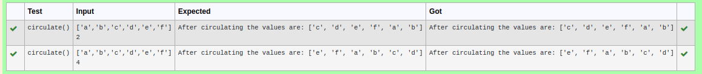

# Circulate-the-values-of-N-variables
## Aim:
To write a python program to circulate the n variables using function concept
## Equipment’s required:
PC
Anaconda - Python 3.7
## Algorithm: 
### Step 1: 
first step is to define from the user    
### Step 2: 
get a,n inputd from the user
### Step 3: 
Get the value from the user for the number of rotation
### Step 4: 
Using the slicing concept rotate the list

### Step 5:
define formula step 
### Step 6: 
print the result
## Program:
```python
def circulate():
    a=eval(input())
    n=eval(input())
    l=a[n:]+a[:n]
    print("After circulating the values are:",l)
```

## Output:

## Result:
by this program we able to circulate the values of n - variables